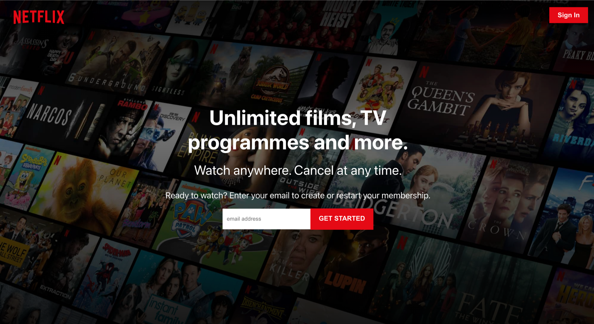
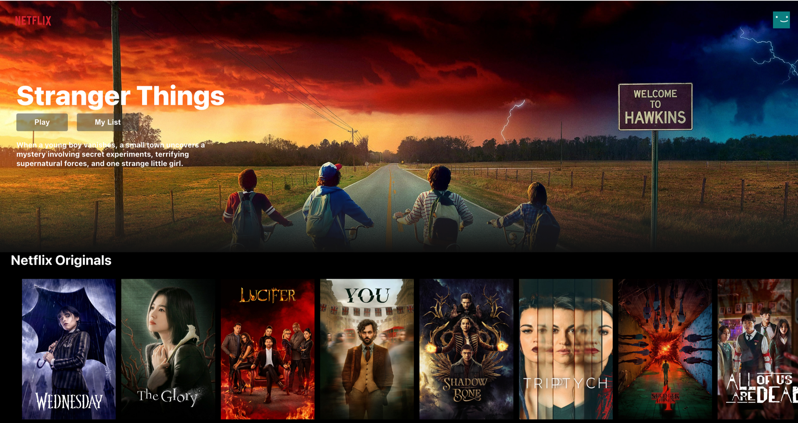

# Front-end React Netflix-Clone Application

Try it here: tbd

## Desktop view





This is a simple Netflix clone, with a dummy registration page, and gallery-style landing page. It utlises an API from TMDB to fetch movie data and subsequently render on screen.

## Quick start

Clone the repo.

```
// Install dependencies (in root and client)
npm install

// Run client and server concurrently
npm start
```

## Technology

This is a front-end, React application, built using:

- React
- Javascript
- JSX
- CSS
- HTML
